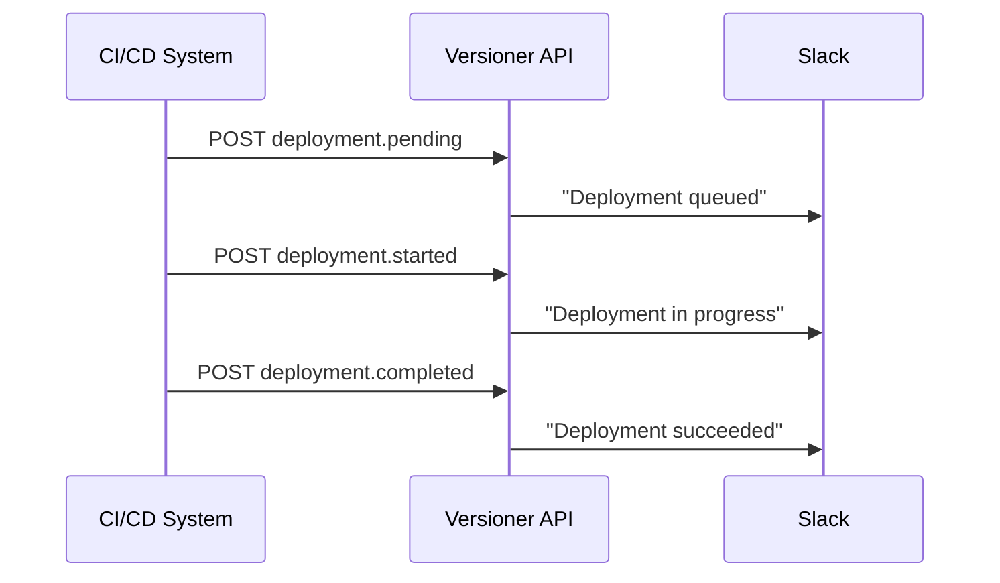
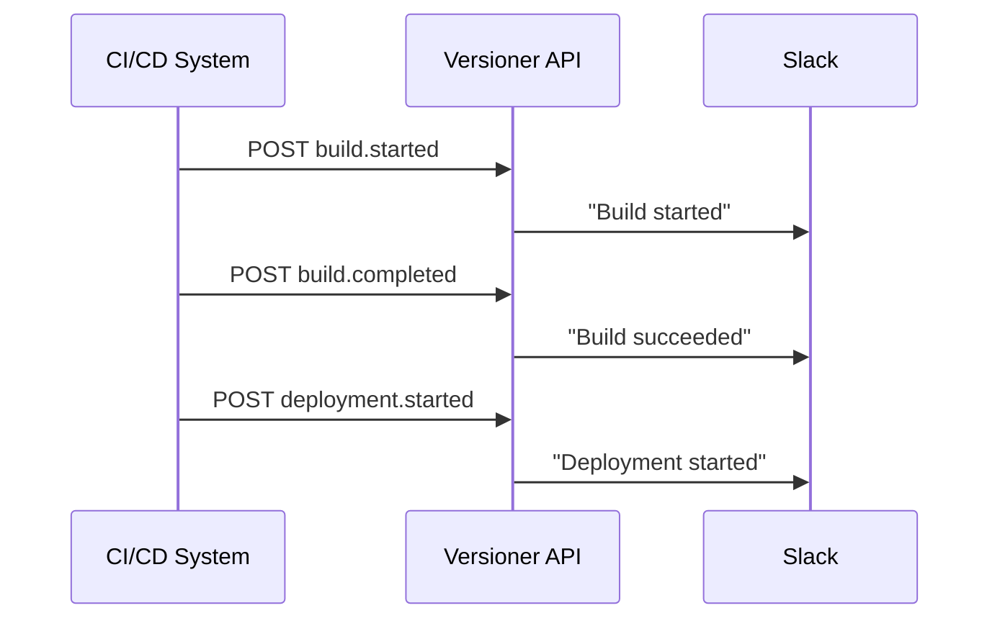

# Event Types

Versioner uses a consistent event model for deployment and version (build) events.

## Event Categories

### Deployment Events

Track the lifecycle of deployments to environments.

| Event Type | Description | Icon |
|------------|-------------|------|
| `deployment.pending` | Deployment queued/scheduled | ⏳ |
| `deployment.started` | Deployment begins (in progress) | 🚀 |
| `deployment.completed` | Deployment succeeds | ✅ |
| `deployment.failed` | Deployment fails with error | ❌ |
| `deployment.aborted` | Deployment cancelled/interrupted | 🛑 |

### Build Events

Track the lifecycle of builds/versions.

| Event Type | Description | Icon |
|------------|-------------|------|
| `build.pending` | Build queued/scheduled | ⏳ |
| `build.started` | Build begins | 🔨 |
| `build.completed` | Build succeeds | ✅ |
| `build.failed` | Build fails with error | ❌ |
| `build.aborted` | Build cancelled/interrupted | 🛑 |

## Status Mapping

The API accepts flexible status strings and maps them to canonical event types.

### Deployment Status

```python
# These all map to "deployment.pending"
["pending", "queued", "scheduled"]

# These all map to "deployment.started"
["started", "in_progress", "init", "deploying"]

# These all map to "deployment.completed"
["success", "completed", "complete", "finished", "deployed"]

# These all map to "deployment.failed"
["failed", "fail", "failure", "error"]

# These all map to "deployment.aborted"
["aborted", "abort", "cancelled", "cancel", "skipped"]
```

### Build Status

```python
# These all map to "build.pending"
["pending", "queued", "scheduled"]

# These all map to "build.started"
["started", "in_progress", "init", "building"]

# These all map to "build.completed"
["success", "completed", "complete", "finished", "built"]

# These all map to "build.failed"
["failed", "fail", "failure", "error"]

# These all map to "build.aborted"
["aborted", "abort", "cancelled", "cancel", "skipped"]
```

## Usage Examples

### Deployment Events

=== "Pending"

    ```bash
    POST /deployment-events/
    {
      "product_name": "my-service",
      "version": "1.2.3",
      "environment_name": "production",
      "status": "pending"
    }
    ```

=== "Started"

    ```bash
    POST /deployment-events/
    {
      "product_name": "my-service",
      "version": "1.2.3",
      "environment_name": "production",
      "status": "started"
    }
    ```

=== "Completed"

    ```bash
    POST /deployment-events/
    {
      "product_name": "my-service",
      "version": "1.2.3",
      "environment_name": "production",
      "status": "success"
    }
    ```

=== "Failed"

    ```bash
    POST /deployment-events/
    {
      "product_name": "my-service",
      "version": "1.2.3",
      "environment_name": "production",
      "status": "failed",
      "extra_metadata": {
        "error": "Lambda timeout after 30s"
      }
    }
    ```

=== "Aborted"

    ```bash
    POST /deployment-events/
    {
      "product_name": "my-service",
      "version": "1.2.3",
      "environment_name": "production",
      "status": "cancelled"
    }
    ```

### Build Events

=== "Pending"

    ```bash
    POST /build-events/
    {
      "product_name": "my-service",
      "version": "1.2.3",
      "status": "pending",
      "built_by": "github-actions"
    }
    ```

=== "Started"

    ```bash
    POST /build-events/
    {
      "product_name": "my-service",
      "version": "1.2.3",
      "status": "started",
      "built_by": "github-actions"
    }
    ```

=== "Completed"

    ```bash
    POST /build-events/
    {
      "product_name": "my-service",
      "version": "1.2.3",
      "status": "completed",
      "built_by": "github-actions",
      "scm_sha": "abc123",
      "build_url": "https://github.com/..."
    }
    ```

=== "Failed"

    ```bash
    POST /build-events/
    {
      "product_name": "my-service",
      "version": "1.2.3",
      "status": "failed",
      "extra_metadata": {
        "error": "Compilation failed"
      }
    }
    ```

=== "Aborted"

    ```bash
    POST /build-events/
    {
      "product_name": "my-service",
      "version": "1.2.3",
      "status": "abort"
    }
    ```

## Event Workflow

### Typical Deployment Flow



### Typical Build Flow



## Notification Configuration

Configure which events trigger Slack notifications:

```bash
# Get notified on all deployment failures
POST /notification-preferences/
{
  "event_type": "deployment.failed",
  "channel_id": "..."
}

# Get notified on successful builds
POST /notification-preferences/
{
  "event_type": "build.completed",
  "channel_id": "..."
}

# Get notified when builds are aborted
POST /notification-preferences/
{
  "event_type": "build.aborted",
  "channel_id": "..."
}
```

See [Notifications](../concepts/notifications.md) for details.

## Best Practices

### 1. Track All States

Track deployments from start to finish:

```bash
# When deployment starts
POST /deployment-events/ { "status": "started" }

# When deployment completes
POST /deployment-events/ { "status": "success" }
```

### 2. Include Error Details

For failures, include error information:

```bash
POST /deployment-events/
{
  "status": "failed",
  "extra_metadata": {
    "error": "Connection timeout",
    "error_code": "TIMEOUT",
    "stack_trace": "..."
  }
}
```

### 3. Use Consistent Status Values

Pick one status value and stick with it:

✅ **Good:** Always use `"success"`
❌ **Avoid:** Mix of `"success"`, `"completed"`, `"finished"`

## Next Steps

- Learn about [Deployments](../concepts/deployments.md)
- Set up [Notifications](../concepts/notifications.md)
- Explore [Event Tracking API](event-tracking.md)
