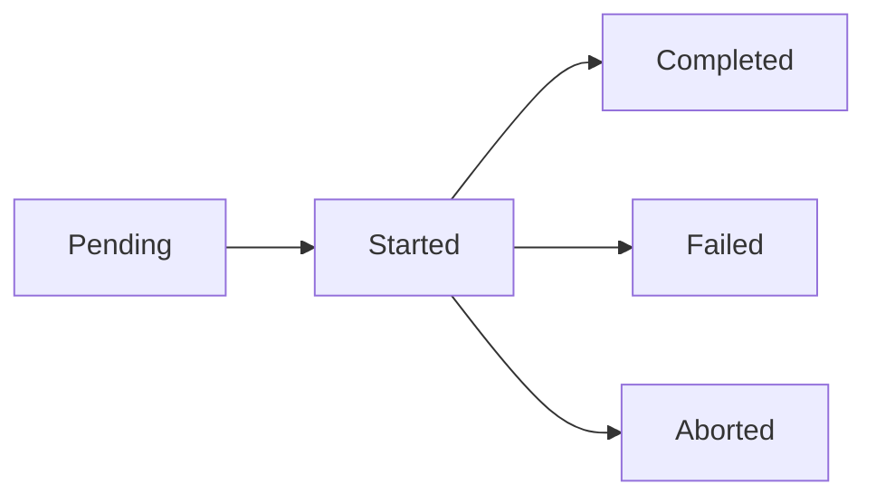

# Deployments

A **deployment** represents a specific version of a product deployed to an environment at a point in time.

## Overview

Deployments are the core entity in Versioner. Every time you deploy a version to an environment, Versioner creates a deployment record that tracks:

- **What** was deployed (product and version)
- **Where** it was deployed (environment)
- **When** it was deployed (timestamp)
- **Who** deployed it (user or system)
- **How** it went (status: success, failed, etc.)

## Deployment Lifecycle

Deployments progress through several states:



### States

| State | Description | When to Use |
|-------|-------------|-------------|
| **Pending** | Deployment is queued or scheduled | Before deployment begins |
| **Started** | Deployment is in progress | When deployment starts |
| **Completed** | Deployment succeeded | When deployment finishes successfully |
| **Failed** | Deployment failed | When deployment encounters an error |
| **Aborted** | Deployment was cancelled | When deployment is manually stopped |

## Deployment Events

You submit deployment events to track state changes:

```bash
# Deployment started
POST /deployment-events/
{
  "product_name": "my-service",
  "version": "1.2.3",
  "environment_name": "production",
  "status": "started"
}

# Deployment completed
POST /deployment-events/
{
  "product_name": "my-service",
  "version": "1.2.3",
  "environment_name": "production",
  "status": "success"
}
```

See [Event Types](../api/event-types.md) for details.

## Deployment Metadata

Deployments can include additional metadata:

```json
{
  "product_name": "my-service",
  "version": "1.2.3",
  "environment_name": "production",
  "status": "success",
  "deployed_by": "john.doe",
  "scm_branch": "main",
  "scm_sha": "abc123def456",
  "build_url": "https://ci.example.com/builds/123",
  "extra_metadata": {
    "deployment_duration_seconds": 120,
    "rollback_version": "1.2.2",
    "deployment_notes": "Hotfix for authentication bug"
  }
}
```

## Querying Deployments

### Get Current State

Find out what's currently deployed:

```bash
GET /deployments/?environment=production&limit=1
```

### Deployment History

View deployment history for a product:

```bash
GET /deployments/?product=my-service&limit=50
```

### Filter by Status

Find failed deployments:

```bash
GET /deployments/?status=failed
```

## Use Cases

### Deployment Visibility

Know exactly what version is running in each environment:

- **Production:** my-service v1.2.3 (deployed 2 hours ago)
- **Staging:** my-service v1.2.4 (deployed 30 minutes ago)
- **Dev:** my-service v1.3.0 (deployed 5 minutes ago)

### Deployment Auditing

Track who deployed what and when:

- All production deployments require approval
- Audit trail for compliance
- Rollback history

### Deployment Metrics

Analyze deployment patterns:

- Deployment frequency
- Success/failure rates
- Time between deployments
- Deployment duration

## Related Concepts

- **[Versions](versions.md)** - What gets deployed
- **[Environments](environments.md)** - Where deployments go
- **[Notifications](notifications.md)** - Get alerted about deployments

## Next Steps

- Learn about [Versions](versions.md)
- Set up [Notifications](notifications.md)
- Explore the [Interactive API Docs](../api/interactive-docs.md)
