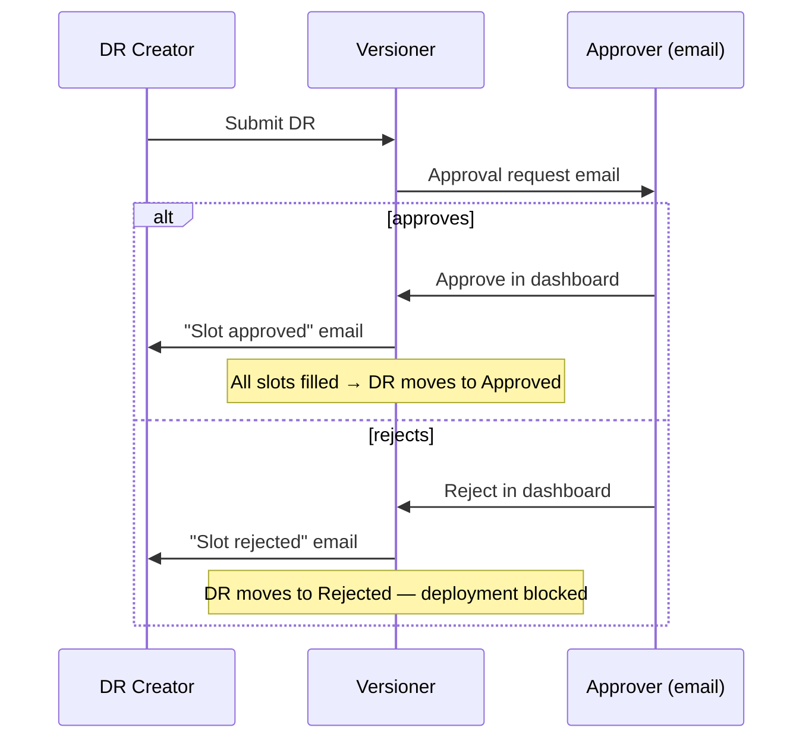

# Deployment Requests

A **Deployment Request (DR)** is Versioner's primary primitive for governed deployments. Think of it as a structured envelope around a single deployment activity — it defines who needs to approve it, what pre/post steps to run, and creates a complete audit record for that specific deployment.

On its own, a DR scopes to one deployment event. Combined with [Deployment Rules](deployment-rules.md), DRs become the mechanism for enforcing org-wide deployment policy (requiring DRs before production, enforcing approval sequences, etc.).

!!! info "Protect tier"
    Deployment Requests are available on Protect tier and above. During your 30-day trial, you have full Protect-level access.

## What a Deployment Request does

- **Gates the deployment** — Requires specific approvals before code ships
- **Runs custom steps** — Pre-deployment checks and post-deployment verification
- **Creates an audit trail** — Who approved what, and when
- **Coordinates teams** — Clear visibility into who still needs to act

## Deployment Request Lifecycle

A DR flows through these states:

| State | Meaning |
|---|---|
| **Draft** | Created but not yet submitted |
| **In Progress** | Submitted — waiting on approval slots |
| **Approved** | All required approvals obtained, ready to deploy |
| **Rejected** | One or more approval slots rejected — deployment blocked |
| **Completed** | Deployed and post-steps finished |

## Creating a Deployment Request

Deployment Requests are created in the Versioner dashboard:

1. Navigate to **Deployments → Deployment Requests**
2. Click **New Deployment Request**
3. Select the product and version
4. Select the target environment
5. Add approval slots by role
6. Save as draft or submit for approval

## Where DRs Surface

- **Deployment Requests** — DRs are created and managed in this page listed in the top navigation
- **Dashboard** — Open DRs appear at the top of the main dashboard, visible to all team members
- **My Tasks** — If your role can approve a DR, you'll see a prompt in the My Tasks page until it's resolved

## Approval Gates

Approval gates ensure the right people review and approve deployments before code ships. Each gate maps to a specific approval type, and each approval type is tied to one or more user roles.

### Role → Approval Type Mapping

| Role | Can Approve |
|------|-------------|
| admin | All types |
| release_manager | All types |
| product | UAT |
| qa | QA, Performance |
| security | Security |
| developer | Code Review |
| compliance | Compliance |
| sre | Performance |
| billing | — |
| viewer | — |

### Approval Workflow

When a DR moves to **In Progress**, Versioner notifies all users whose role matches an approval slot. Each approver receives an email with a direct link to act. The DR creator is notified by email when any slot is resolved.



## Multi-Product Deployments

A single DR can coordinate deployments across multiple products. When creating the DR, add all the products and versions being deployed together. This is useful for coordinating related services that ship together (e.g., an API and its web frontend). All products in the DR go through the same approval flow and produce a single DR audit record.

## Deployment Steps

!!! info "Enforce tier"
    Pre- and post-deployment steps are available on Enforce tier and above.

Steps are manually marked complete by an authorized user. The dashboard and audit log both record who marked each step complete and when.

### Pre-Deployment Steps

Custom checklist items that must be completed before deployment begins. Useful for:

- Running smoke tests
- Verifying database migrations are ready
- Checking resource availability
- Custom validation steps

### Post-Deployment Steps

Custom checklist items to complete after deployment. Useful for:

- Running health checks
- Notifying stakeholders
- Updating a status page or runbook
- Triggering monitoring verification

## Deployment Request Templates

Templates are reusable DR configurations that pre-define approval slots, pre/post steps, and other settings. Select a template when creating a DR to auto-populate it — all settings can be customized for individual DRs.

!!! info "Enforce tier"
    DR Templates are available on Enforce tier and above.

### Creating a Template

1. Navigate to **DR Templates** in the main navigation
2. Click **New Template**
3. Configure the template name, description, default approval slots, pre/post steps, and which environments it applies to
4. Save

## Common Workflows

### Simple Approval

```
1. Create DR for new version
2. DR routes to product team for UAT approval
3. Product team reviews via email link
4. Product team approves in Versioner dashboard
5. DR transitions to Approved
6. Deployment proceeds
```

### Multi-Approval Flow

```
1. Create DR requiring product + security approval
2. Approval emails sent to both teams
3. Product team approves ✓
4. Security team reviewing... ⏳
5. Security team rejects ✗
6. DR transitions to Rejected
7. DR creator receives rejection email with feedback
8. Address feedback and create new DR
```

### Coordinated Multi-Service Deploy

```
1. Create multi-product DR for api:2.0.0 + web:3.1.0
2. Both products require QA approval
3. QA reviews both in single DR
4. QA approves
5. Both services deploy with a single audit record
```

## Related Concepts

- **[Deployment Rules](deployment-rules.md)** - Automated enforcement of deployment policy
- **[User Roles](../configuration/user-roles.md)** - Roles determine who can approve which deployment types
- **[Environment State Matrix](environment-state-matrix.md)** - See current state before creating a DR
- **[Products](../catalog/products.md)** - Products are deployed via DRs
- **[Versions](../catalog/versions.md)** - Versions are what DRs deploy

## Next Steps

- Learn about [Deployment Rules](deployment-rules.md) to automate policy enforcement
- Explore [User Roles](../configuration/user-roles.md) to understand approval capabilities
- Check [Getting Started](../../getting-started/quick-start.md) for setup guidance
