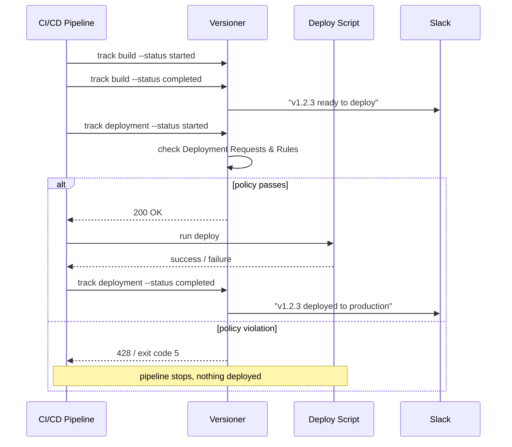

# How It Works

Versioner sits alongside your existing CI/CD pipeline. You send events at key moments — when a build finishes, when a deployment starts, when it completes — and Versioner tracks state, enforces policy, and notifies your team.

There are two phases: **build** and **deployment**. You can use both or just the deployment phase on its own.

!!! info "Everything is created on the fly"
    You don't need to pre-configure products, versions, or environments. Versioner creates them automatically the first time it sees them in an event. Just start sending events.

    Products and environments can be renamed and updated in the UI after creation. **Versions are immutable** — once a version is registered with a given commit SHA, that pairing is permanent. Sending a second build event for the same version number with a different SHA returns a `409 Conflict`. Pick a versioning scheme where each build gets a unique version string.

---

## Build Phase

### 1. Send a build started event

When your CI pipeline begins building a new version, send a `started` build event. This registers the build in Versioner so you have a full record from the start.

### 2. Send a build completed (or failed) event

When the build finishes, send `completed` or `failed`. On success, Versioner registers the new version and — if you have notifications configured — posts to your Slack channel to let the team know something is ready to deploy.

From that notification (or from the Versioner dashboard), someone can:

- Click a [Deployment Button](../concepts/deployment-buttons.md) to trigger your deployment system directly
- Copy the version number and plug it into your CI/CD system manually

**Skipping the build phase is fine.** If you only send deployment events, Versioner creates the version on the fly. You just won't get the "ready to deploy" Slack notification.

---

## Deployment Phase

### 3. Send a deployment started event

Send a `started` deployment event *before* your deployment script runs. Include the product, version, and target environment.

This is when Versioner enforces policy. On receiving a `started` event, Versioner checks:

**Deployment Requests**

If there's an open [Deployment Request](../concepts/deployment-requests.md) covering this product/environment combination, Versioner checks whether it's ready to proceed:

- All required approvals obtained
- All pre-deploy checklist steps marked complete

**Deployment Rules**

Versioner also evaluates any [Deployment Rules](../concepts/deployment-rules.md) that match the target product or environment:

- **Schedule rules** — blocks deployment during a defined no-deploy window (e.g. weekends, release freezes)
- **DR Requirement rules** — requires any deployment to this product/environment to be associated with an open Deployment Request
- **Flow rules** — enforces a required sequence of environments (e.g. test → staging → production) and/or minimum soak times in environments
- **Version Approval rules** — requires the version itself to have a sign-off before it can be deployed anywhere

!!! info "Violation behavior"
    In either case, if anything is outstanding, Versioner returns a `428 Precondition Required` and your pipeline fails — before anything is deployed.

### 4. Deploy

Your actual deployment runs. Versioner is out of the way at this point.

### 5. Send a deployment completed (or failed) event

Send `completed` or `failed` to close out the record. Versioner updates the environment state and fires any configured notifications.

---

## Full Lifecycle at a Glance

---

## Next Steps

- [Quick Start](quick-start.md) — send your first event in minutes
- [Deployment Requests](../concepts/deployment-requests.md) — approval gates and pre-deploy steps
- [Deployment Rules](../concepts/deployment-rules.md) — automated policy enforcement
- [CI/CD Integrations](../integrations/index.md) — choose your integration method
