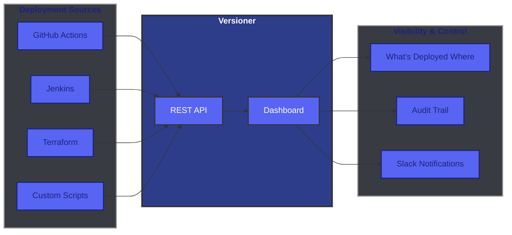

# Versioner Documentation

**Versioner** is a deployment tracking and visibility platform designed to help engineering teams maintain a shared view of what's deployed where, detect drift, and improve auditability in release pipelines.

## 🔍 Unified Deployment Visibility



## 🚀 Quick Start

Get started with Versioner in minutes:

1. **[Create an account](getting-started.md#step-1-create-an-account-and-get-your-api-key)** - Sign up and get your API key
2. **[Choose your integration](getting-started.md#step-2-choose-your-integration)** - Native (e.g. GitHub Action), CLI, or direct API
3. **[Submit your first event](getting-started.md#step-3-submit-your-first-event)** - Track your first deployment

## 📚 Choose Your Integration

Versioner provides multiple ways to integrate with your workflow:

<div class="grid cards" markdown>

-   :material-puzzle:{ .lg .middle } **Native Integrations**

    ---

    Platform-specific plugins for GitHub Actions and more.

    [:octicons-arrow-right-24: View Integrations](integrations/index.md)

-   :material-console:{ .lg .middle } **CLI**

    ---

    Universal command-line tool for any CI/CD system or deployment environment.

    [:octicons-arrow-right-24: CLI Documentation](cli/index.md)

-   :material-api:{ .lg .middle } **REST API**

    ---

    Direct API access for custom integrations and maximum control.

    [:octicons-arrow-right-24: API Documentation](api/index.md)

</div>

## 🎯 Key Features

### Deployment Tracking
Track every deployment across all your environments. Know exactly what version is running where, who deployed it, and when.

### Version Management
Manage build versions with flexible versioning schemes - semantic versioning, build numbers, commit SHAs, or any custom format.

### Real-time Notifications
Get instant Slack notifications for deployments, builds, and failures. Customize which events trigger notifications.

### Deployment Buttons
Trigger deployments with one click. Deployment buttons in the UI and Slack notifications link directly to your deployment tools with pre-filled parameters.

### Pre-flight Checks
Validate deployments before they happen. Prevent concurrent deployments, enforce no-deploy windows, and require approvals.

## 🧩 Core Concepts

Understanding these concepts will help you get the most out of Versioner:

- **[Products](concepts/products.md)** - Deployable software components (services, apps, libraries)
- **[Versions](concepts/versions.md)** - Build artifacts that can be deployed
- **[Deployments](concepts/deployments.md)** - Records of versions deployed to environments
- **[Releases](concepts/releases.md)** - Coordinated groupings of multiple product versions
- **[Environments](concepts/environments.md)** - Deployment targets (dev, staging, production)
- **[Notifications](concepts/notifications.md)** - Real-time alerts via Slack
- **[Variables](concepts/variables.md)** - Reusable configuration values
- **[Deployment Buttons](concepts/deployment-buttons.md)** - One-click deployment shortcuts

## 🔗 API Reference

Comprehensive API documentation:

- **[Authentication](api/authentication.md)** - API key management and authentication
- **[Event Tracking](api/event-tracking.md)** - Submit deployment and build events
- **[Interactive Docs](api/interactive-docs.md)** - Explore all endpoints
- **[Event Types](api/event-types.md)** - Deployment and version event types
- **[Response Codes](api/response-codes.md)** - HTTP status codes and error handling

## 💡 Example Use Cases

### CI/CD Integration
Automatically track deployments from your CI/CD pipeline:

```yaml
# GitHub Actions example
- uses: versioner-io/versioner-github-action@v1
  with:
    api-key: ${{ secrets.VERSIONER_API_KEY }}
    product: my-service
    version: ${{ github.sha }} # Or version ID of your choice
    environment: production
```

### Deployment Visibility
Query deployment history to see what's running where:

```bash
# CLI example
versioner deployments list --product my-service --environment production
```

## 🆘 Support

- **Contact:** support@versioner.io
- **API Status:** [status.versioner.io](https://status.versioner.io) _(coming soon)_


## 🗺️ What's Next?

Ready to get started? Head over to the [Getting Started Guide](getting-started.md) to create your account and submit your first event.

Or explore the documentation:

- Browse [Integrations](integrations/index.md)
- Learn about [Core Concepts](concepts/index.md)
- Explore the [CLI](cli/index.md) or [API](api/index.md)
