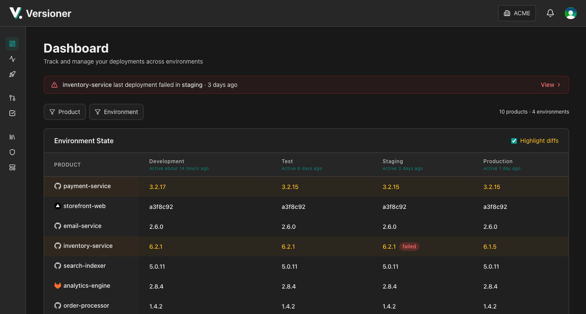

# Versioner

**Versioner** is a deployment operations and governance layer that combines real-time environment state with the rules, approvals, and pre/post-deploy steps you define to decide whether a deployment is allowed to proceed. It works across the tools you already use, without asking you to consolidate or change your processes.

[Get started →](getting-started/index.md){ .md-button .md-button--primary }
[How it works](concepts/how-it-works.md){ .md-button }

## Three Pillars of Deployment Governance

-   :material-eye-outline:{ .lg .middle } **Observe**

    ---

    See exactly what version of each product runs in each environment. Detect drift automatically.

    *Free — available on all plans*

-   :material-shield-check-outline:{ .lg .middle } **Protect**

    ---

    Create Deployment Requests, route to the right approvers, and track quality gates per version.

    *Protect tier and above*

-   :material-gavel:{ .lg .middle } **Enforce**

    ---

    Define org-wide policies: no-deploy windows, required sequences, approval gates, version requirements.

    *Enforce tier*

