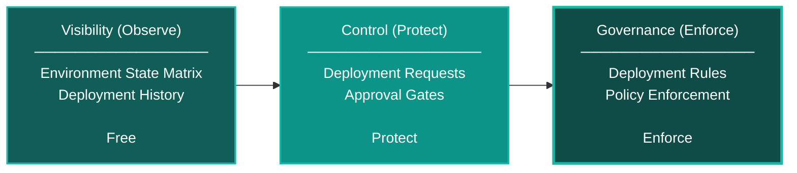

# Versioner

**Versioner** is a deployment operations and governance layer that combines real-time environment state with the rules, approvals, and pre/post-deploy steps you define to decide whether a deployment is allowed to proceed. It works across the tools you already use, without asking you to consolidate or change your processes.

## Three Pillars of Deployment Governance

```mermaid
flowchart LR
    V["Visibility (Observe)<br/>─────────────────<br/>Environment State Matrix<br/>Deployment History<br/><br/>Free"]
    C["Control (Protect)<br/>─────────────────<br/>Deployment Requests<br/>Approval Gates<br/><br/>Protect"]
    G["Governance (Enforce)<br/>─────────────────<br/>Deployment Rules<br/>Policy Enforcement<br/><br/>Enforce"]

    V --> C --> G

    style V fill:#115e59,stroke:#14b8a6,stroke-width:2px,color:#fff
    style C fill:#0d9488,stroke:#14b8a6,stroke-width:2px,color:#fff
    style G fill:#0f4c47,stroke:#14b8a6,stroke-width:3px,color:#fff
```

**Observe** — See exactly what version of each product runs in each environment. Detect drift automatically.  
**Protect** — Create Deployment Requests, route to the right approvers, track quality gates per version.  
**Enforce** — Define org-wide policies: no-deploy windows, required sequences, approval gates, version requirements.

## 🚀 Quick Start

1. **[Create an account](getting-started.md#step-1-create-an-account-and-get-your-api-key)** — Sign up and get your API key
2. **Choose your integration:**
     - [Native Integrations](integrations/index.md) — GitHub Actions and more
     - [CLI](cli/index.md) — any CI/CD system
     - [REST API](api/index.md) — custom integrations
3. **[Submit your first event](getting-started.md#step-4-submit-your-first-event)** — Track your first deployment

## Core Concepts

- **[Environment State Matrix](concepts/environment-state-matrix.md)** — See what's deployed where at a glance
- **[Deployment Requests](concepts/deployment-requests.md)** — A governance envelope for an individual deployment event
- **[Deployment Rules](concepts/deployment-rules.md)** — Org-wide policies that enforce governance across deployments
- **[Products](concepts/products.md)** — Deployable software components
- **[Versions](concepts/versions.md)** — A build artifact or git ref that's ready to deploy
- **[Environments](concepts/environments.md)** — Deployment targets (dev, staging, production)

## 🆘 Support

- **Contact:** support@versioner.io
- **API Status:** [status.versioner.io](https://status.versioner.io) _(coming soon)_
